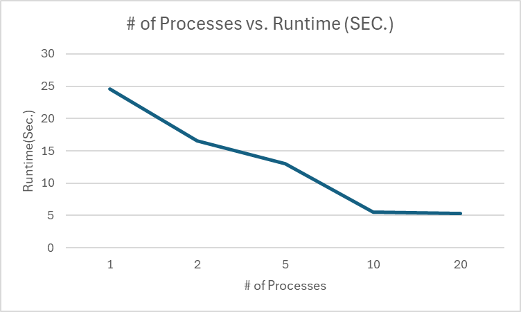
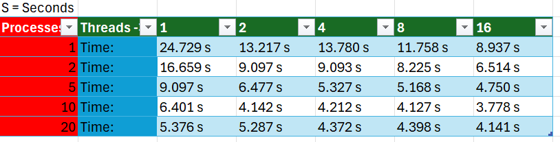

## System Programming Lab 11 Multiprocessing

# A brief overview of this implementation is that i have taken the mandel, and have implemented the multiprocessing feature by adding a Mn:n , which tells the program that -M isn't supposed to have an arguement. After that the program will see that you want to make a movie with the amount of processors you specified when starting the program. 

# The results of the run time is that at 1 processors was the slowest run time, at 2 processors it was almost twice as fast but that is probably with the amount of tabs that i have open. but with each instance of more processes the program will take shorter time to complete it. Although the only issue was that the time difference between 10 and 20 is very little seeing was less than 200 milliseconds.

## System Programming Lab 12 Multiprocessing

# A brief overview with multithreading is that i had taken what was prevoiusly done before and added the t to the getopt, whihc tells the program that it will have an amount of threads less than 20 to get the image done faster. The compute_image function had change by adding the threading sturct and function outside of the main to then be used within the compute_image function.

## The new table image of threads and processors

# The results of the table showed that the technique that impacted that generation of the image more was multithreading.When going from 1 to 2 processors only cut time but 9 seconds, but with multithreading it cut the time by 12 seconds. The reason why i think this is that adding more threading help the image be generated twice as fast as it splits the image into 2 regions to work on, instead of the pixel by pixel method that we had before with multithreading. The sweet spot I found where the optimal runtime was achieved was with 10 processors and 16 threads.